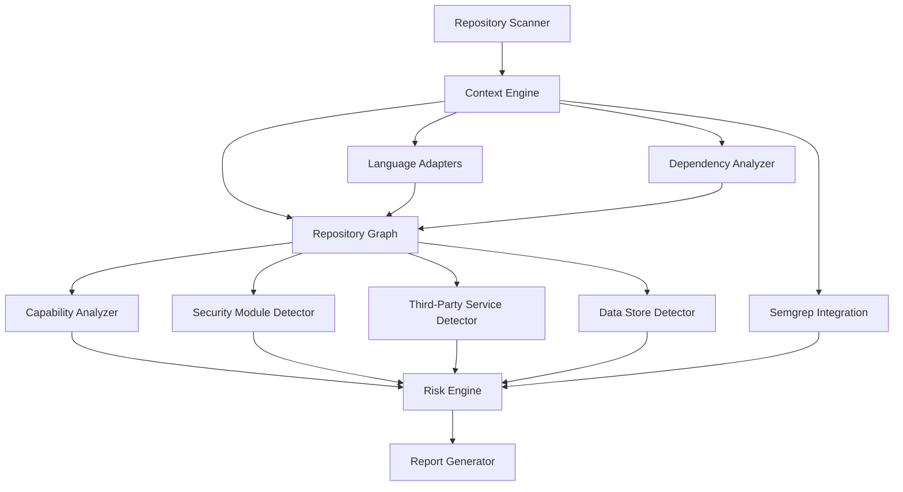

# AppSec Platform Redesign

## Target Architecture



## Design Principles

- Use a repository graph as the primary data structure.
- Treat file parsing, manifest parsing, and dependency resolution as separate concerns.
- Keep language parsing behind adapters so new ecosystems do not require core rewrites.
- Prefer evidence from imports, manifests, declarations, and edges over keyword matching.
- Normalize all outputs before scoring or reporting.
- Keep the scan API thin; orchestration belongs in application services, not controllers.

## Folder Structure

```text
src/
  core/
    contracts/
      appsec.contracts.ts
    domain/
      appsec.types.ts
    scanner/
      file-classifier.service.ts
      repository-scanner.service.ts
    language/
      language-adapter.interface.ts
      language-registry.service.ts
      adapters/
        node-typescript.adapter.ts
    dependency/
      dependency-analyzer.service.ts
    graph/
      repository-graph.service.ts
    capability/
      capability-analyzer.service.ts
    context/
      context-engine.service.ts
    risk/
      risk-engine.service.ts
    report/
      report.service.ts
    orchestrator/
      scan-orchestrator.service.ts
    utils/
      async.ts
  routes/
    scan.route.ts
```

## Contracts

- `RepositoryScannerContract`: returns file descriptors and reads file content on demand.
- `LanguageAdapterContract`: parses a file into structural facts.
- `DependencyAnalyzerContract`: parses manifests and resolves declared vs used dependencies.
- `RepositoryGraphContract`: stores nodes and edges as a first-class artifact.
- `ContextEngineContract`: returns files, coverage, graph, context, source facts, and dependency analysis.
- `CapabilityAnalyzerContract`: converts graph and source evidence into normalized capabilities.
- `RiskEngineContract`: scores normalized findings using severity, reachability, exposure, exploitability, criticality, and business impact.
- `ReportGeneratorContract`: produces a stable report schema.

## Data Model

### Repository file descriptor

- Path, file kind, language, size, binary flag, manifest flag, source flag, config flag, generated flag.

### Source fact set

- Imports
- Function calls
- Environment references
- Declarations
- Exports

### Repository context

- Technology stack
- Third-party dependencies
- Third-party services
- Repository modules
- Security modules
- Capabilities
- Exposures
- Data stores

### Repository graph

- Node kinds: repository, file, manifest, module, symbol, dependency, service, endpoint, datastore, capability, finding, technology.
- Edge kinds: contains, imports, calls, declares, depends_on, uses_service, exposes, reads_from, writes_to, belongs_to, resolves_to, references.

### Risk and report

- Findings are normalized into a common schema.
- Risk score is derived from findings plus repository context.
- Reports include repository summary, context, graph, findings, risk, recommendations, and coverage.

## Implementation Notes

### Repository Scanner

- Uses `fast-glob` with a generic ignore profile.
- Classifies files by kind and language.
- Reads content only for files that matter to analysis.
- Supports a concurrency limit for large repositories.

### Context Engine

- Resolves language adapters.
- Parses source facts.
- Parses manifests.
- Builds graph relationships.
- Produces repository-level context from graph evidence.

### Dependency Analyzer

- Parses common manifests across ecosystems.
- Resolves declared vs used packages from imports and source facts.
- Supports future adapter-specific enrichers for non-JS ecosystems.

### Capability Analyzer

- Derives capabilities from graph evidence, source calls, imports, env access, and dependency categories.
- Keeps capability naming normalized and reusable across ecosystems.

### Risk Engine

- Uses weighted factors instead of simple finding counts.
- Incorporates context baseline even when semgrep returns no findings.
- Returns both a numeric score and the factor breakdown.

### Report Generator

- Produces a stable output schema.
- Derives recommendations from structural findings and repository context.
- Avoids embedding scoring logic inside presentation logic.

## Migration Plan

### Phase 1

- Replace legacy route orchestration with the new scan orchestrator.
- Keep Semgrep as a normalized finding source.
- Retire dead scripts and prototype-only controllers.

### Phase 2

- Add adapters for Java, Python, Go, .NET, PHP, Ruby, and Rust.
- Add import resolution for those ecosystems.
- Expand dependency parsing for ecosystem-specific manifests and lockfiles.

### Phase 3

- Persist the graph and scan results.
- Add incremental scans and diff-based reporting.
- Add policy packs and suppression workflows.

### Phase 4

- Add worker isolation for large repositories.
- Add monorepo partitioning and service boundary detection.
- Add multi-repository tenancy and role-based access control.

## Files Changed

### Created

- `src/core/contracts/appsec.contracts.ts`
- `src/core/domain/appsec.types.ts`
- `src/core/scanner/file-classifier.service.ts`
- `src/core/scanner/repository-scanner.service.ts`
- `src/core/language/language-adapter.interface.ts`
- `src/core/language/language-registry.service.ts`
- `src/core/language/adapters/node-typescript.adapter.ts`
- `src/core/utils/async.ts`
- `src/core/graph/repository-graph.service.ts`
- `src/core/dependency/dependency-analyzer.service.ts`
- `src/core/capability/capability-analyzer.service.ts`
- `src/core/context/context-engine.service.ts`
- `src/core/risk/risk-engine.service.ts`
- `src/core/report/report.service.ts`
- `src/core/orchestrator/scan-orchestrator.service.ts`
- `docs/architecture/appsec-platform-redesign.md`

### Refactored

- `src/routes/scan.route.ts`
- `src/app.ts`
- `src/core/contracts/appsec.contracts.ts`

### Deleted

- `src/test.ts`
- `src/test-semgrep.ts`
- `src/controllers/scan.controller.ts`
- `src/context/dependency.analyzer.ts`
- `src/context/repositoryModule.analyzer.ts`
